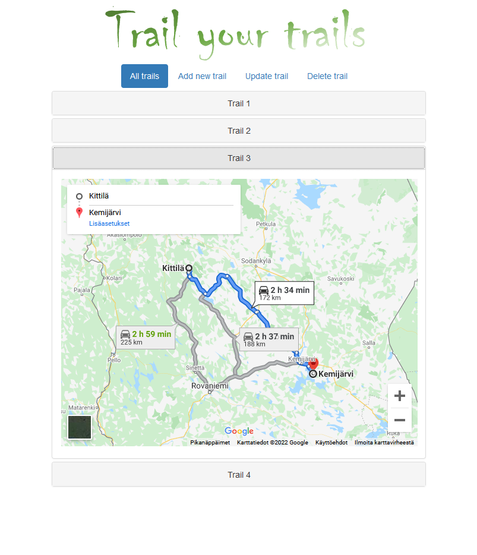
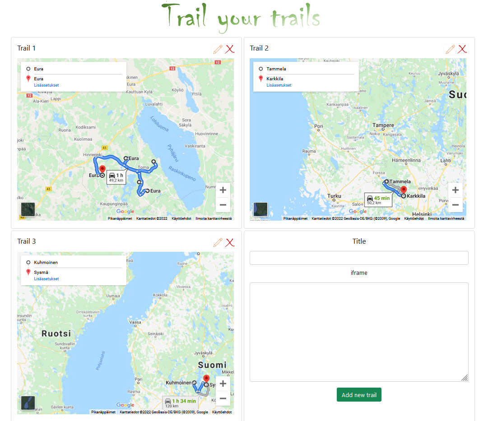

# Trail your trails application

This repository contains all needed Docker files to build and run Trail your trails application cluster.

Needed commands
- To build needed Docker images run: 	**docker-compose -f docker-compose.yml build --build-arg API_IP=\<YOUR SERVER IP ADDRESS\>**
- To run the cluster: **docker-compose -f docker-compose.yml up**
 
Above commands will build and run the cluster with
- A Single node for AngularJS based front end application. Source code repository: https://github.com/PKarppinen/tyt-frontend-repo
- A Single node for React.js based front end application. Source code repository: https://github.com/PKarppinen/tyt-frontend-react
- A Single node for back end application. Source code repository: https://github.com/PKarppinen/tyt-api-repo
- A Single node for MongoDB database

All nodes will be in Docker containers. The cluster is set up by Docker-compose. There are no load balancers, any other proxies, auto scaling etc.

Back end application is protected by Spring Security and Basic authentication. Back end API is only accessible from the front end application.

Simple architecture diagram of the setup

Better approach would be to use multi node cluster with load balancers. For example in AWS ECS

Screenshot of the AngularJS based GUI

Screenshot of the React.js based GUI

